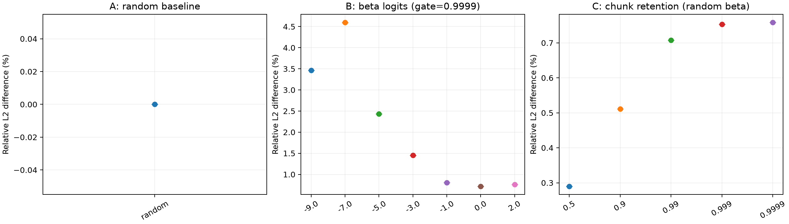
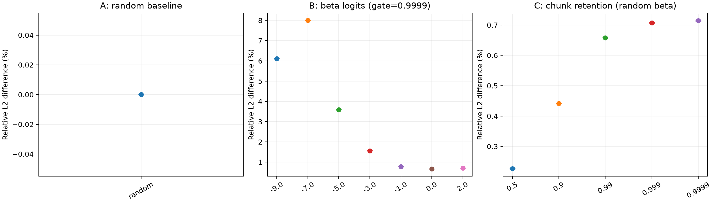

# BF16 状态保存：A/B/C 实测结果

65 组输入，5 个 seed；N=1、T=8192、H=96、D=128、CHUNK=16。全部 BF16 microbench 与真实 kernel 的输出、最终状态逐元素一致，所有比较结果有限。

下表为 seed 范围。差异是 BF16 保存相对 FP32 主状态保存的差异，不是数学真值误差或模型任务准确率。状态统一格式指 FP32 最终状态仅在比较时转 BF16。

| 组 | 参数 | 输出相对 L2 % | 末尾 1024 token 相对 L2 % | 最终状态相对 L2 %（统一格式） | 最大绝对输出差异 | 实际 gate 均值 | 实际 beta 均值 |
|---|---|---|---|---|---|---|---|
| A 随机基线 | random | 0.0000–0.0000 | 0.0000–0.0000 | 0.0000–0.0000 | 0 | 1.36527759e-14 | 0.50013926 |
| B beta logit 扫描 | -9.0 | 3.4613–3.4617 | 5.7187–5.7193 | 6.1057–6.1067 | 0.0005493164 | 0.999899983 | 0.000123023987 |
| B beta logit 扫描 | -7.0 | 4.5942–4.6002 | 7.5065–7.5171 | 7.9917–8.0049 | 0.0007629395 | 0.999899983 | 0.000911712646 |
| B beta logit 扫描 | -5.0 | 2.4304–2.4344 | 3.4931–3.5012 | 3.5886–3.5945 | 0.0003051758 | 0.999899983 | 0.00668334961 |
| B beta logit 扫描 | -3.0 | 1.4496–1.4511 | 1.5798–1.5830 | 1.5633–1.5656 | 0.0001831055 | 0.999899983 | 0.0473632812 |
| B beta logit 扫描 | -1.0 | 0.8044–0.8046 | 0.8160–0.8173 | 0.7726–0.7735 | 0.0002441406 | 0.999899983 | 0.26953125 |
| B beta logit 扫描 | 0.0 | 0.7167–0.7168 | 0.7227–0.7232 | 0.6679–0.6690 | 0.0003662109 | 0.999899983 | 0.5 |
| B beta logit 扫描 | 2.0 | 0.7588–0.7590 | 0.7640–0.7647 | 0.7042–0.7061 | 0.0004882812 | 0.999899983 | 0.87890625 |
| C chunk gate 扫描 | 0.5 | 0.2898–0.2900 | 0.2904–0.2907 | 0.2258–0.2276 | 0.0001220703 | 0.503507555 | 0.50013926 |
| C chunk gate 扫描 | 0.9 | 0.5111–0.5112 | 0.5124–0.5130 | 0.4406–0.4424 | 0.0002441406 | 0.899421692 | 0.50013926 |
| C chunk gate 扫描 | 0.99 | 0.7078–0.7079 | 0.7129–0.7133 | 0.6577–0.6606 | 0.0003662109 | 0.990206361 | 0.50013926 |
| C chunk gate 扫描 | 0.999 | 0.7530–0.7532 | 0.7596–0.7601 | 0.7064–0.7093 | 0.0004882812 | 0.999015808 | 0.50013926 |
| C chunk gate 扫描 | 0.9999 | 0.7584–0.7586 | 0.7655–0.7660 | 0.7130–0.7156 | 0.0004882812 | 0.999899983 | 0.50013926 |

非零更新丢失比例仅保留在原始诊断数据，不作为准确性判据。没有预设任意的通过阈值。

[原始数据](analysis/DATA.md) · [实验设计](REPORT.md)

